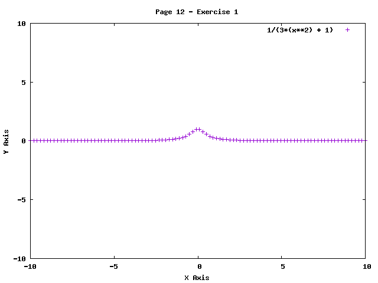

## Page 12 - Exercises

1)

2) (a), (c) and (d)

----------------------------------------

## Page 17 - Exercises

1) 

Touches ordinate on (0,-1).

2)

----------------------------------------

## Page 21 - Exercises

1) 

2)

3)

